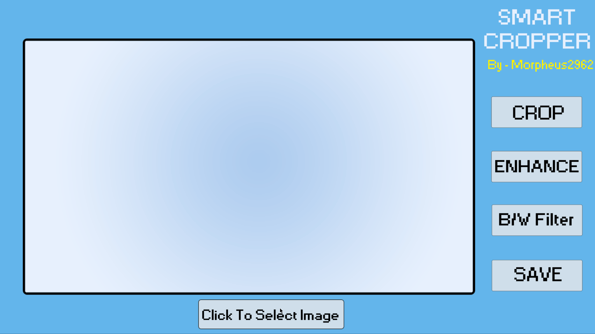
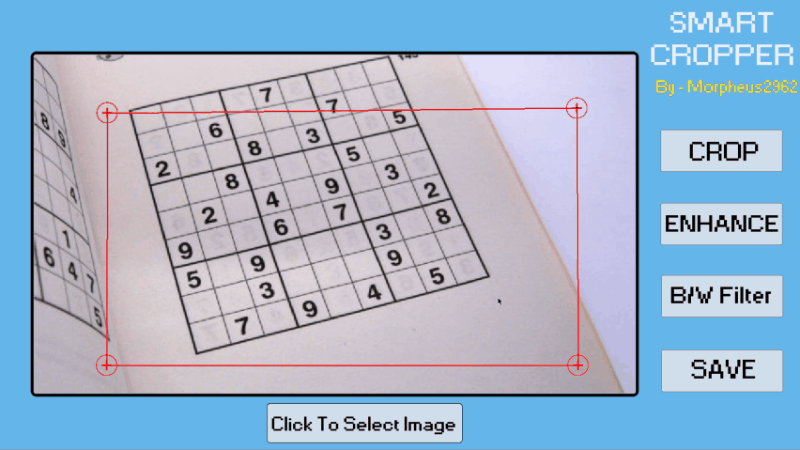
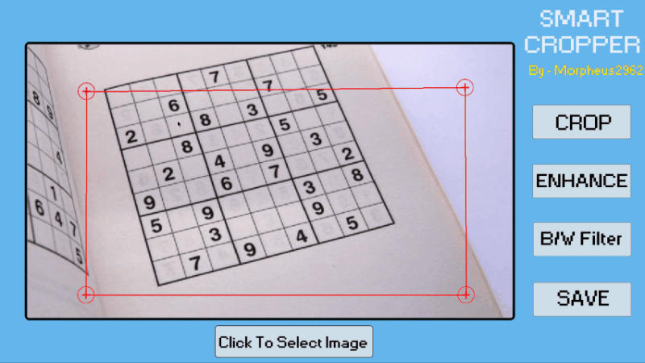

# Smart Cropper:

Smart Cropper is an image cropping tool which also straightens image. It uses python libraries to open and edit image. Along with crop it also can enhance and apply black and white filter.

You can use Smart filter to straighten rotated or bend documents and enhance them to make it sharper and make it easy to read.

## Usage: 

**Dependencies**

The Python libraries used are:

  * Numpy
  * Opencv
  * Pygame
  * Tkinter

To run the program you will need to install required libraries. To install them:

	$ pip install -r requirements.txt

**How to Use**

To use Smart Cropper run:

	  $ python Smart_Cropper.py

After running select the image you want to edit by clicking on "Click to Select Image" Button

   

   

Then if you want to crop drag the cross points to crop image and click "Crop" button

If you want to apply filter click on "Enhance" or "B/W filter" button

Then to Save edited image click "Save" button

*Note : You can crop and apply filters to cropped image also.
